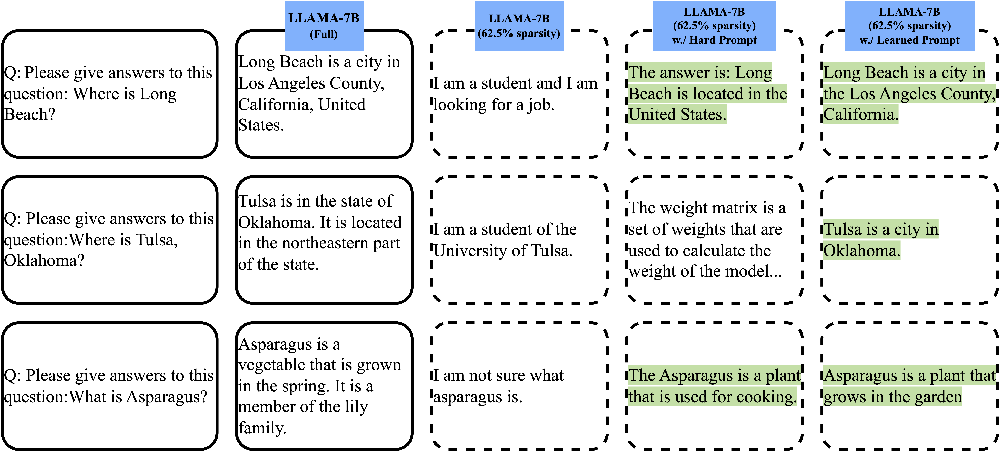

# Soft Prompt Recovers Compressed LLMs, Transferably

Implementation of [Soft Prompt Recovers Compressed LLMs, Transferably](https://arxiv.org/abs/2305.11186)

## Overview
Model compression is one of the most popular approaches to improve the accessibility of LLMs by reducing their memory footprint. However, the gaining of such efficiency benefits often simultaneously demands extensive engineering efforts and intricate designs to mitigate the performance decline. We leverage (Soft) Prompt Tuning in its most vanilla form and discover such conventionally learned soft prompts can recover the performance of compressed LLMs. More surprisingly, we observe such recovery effect to be transferable among different tasks and models (albeit natural tokenizer and dimensionality limitations), resulting in further overhead reduction and yet, subverting the common belief that learned soft prompts are task-specific. 
<p align="center">

</p>

## Run main Experiments

First, compress the model and save it to the local dir. 
```
SAVE_DIR='./' # change it to your directory to save the compressed model

# For GPTQ
cd gptq
python llama.py decapoda-research/llama-7b-hf c4 --wbits 3 --true-sequential --act-order --new-eval --save --save_dir $SAVE_DIR

# For SparseGPT
cd sparsegpt
python llama.py decapoda-research/llama-7b-hf c4 --new-eval --save --save_dir $SAVE_DIR --sparsity 0.75
```

Then, learn the soft prompt over the compressed model

```
GPUID
bash scripts/gptq {GPU_ID} {SAVE_DIR} # Reset the model_name_or_path to your $SAVE_DIR in the first step
```


## Acknowledgment
Our code is based on the official code of GPTQ and SparseGPT.


## Citation

If you find our method useful, please kindly cite our paper.

```bibtex
@article{xu2023compress,
  title={Compress, then prompt: Improving accuracy-efficiency trade-off of llm inference with transferable prompt},
  author={Xu, Zhaozhuo and Liu, Zirui and Chen, Beidi and Tang, Yuxin and Wang, Jue and Zhou, Kaixiong and Hu, Xia and Shrivastava, Anshumali},
  journal={arXiv preprint arXiv:2305.11186},
  year={2023}
}
```


## License
The code is released under the MIT License.